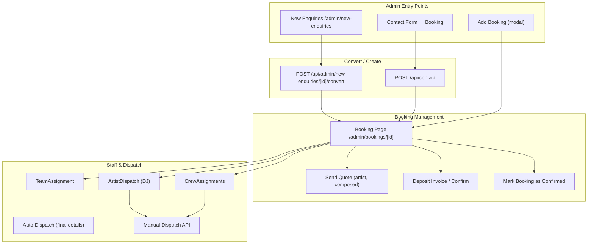

# Admin Flow Audit – New Enquiry to Dispatch

**Portal-email workflow updated:** 30 July 2026
The wider flow audit remains a point-in-time review. This update reflects the removal of portal invitations and links from client-facing emails.

## 1. Flow Overview

---

## 2. Admin Flow: New Enquiry → Dispatch

### 2.1 New Enquiry

| Step | UI | API | Status |
|------|-----|-----|--------|
| List enquiries | `/admin/new-enquiries` | `GET /api/admin/new-enquiries` | OK |
| View enquiry | `/admin/new-enquiries/[id]` | `GET /api/admin/new-enquiries/[id]` | OK |
| Convert to booking | Convert button | `POST /api/admin/new-enquiries/[id]/convert` | OK |
| Review (mark reviewed) | Review button | `POST /api/admin/new-enquiries/[id]/review` | OK |

**Wiring:** New enquiry page fetches enquiry, convert calls API, redirects to booking page on success.

---

### 2.2 Quote / Deposit

| Step | UI | API | Status |
|------|-----|-----|--------|
| Send artist quote | MultiArtistReply / DJInquiryReply | `POST /api/admin/send-artist-quote` | OK |
| Send composed email | EmailCompositionCenter | `POST /api/admin/send-composed-email` | OK |
| Send deposit invoice | Deposit card button | `POST /api/admin/bookings/[id]/send-deposit-invoice` | OK |
| Mark deposit received | FlexibleOperatorSidebar / flexible-update | `PATCH /api/admin/bookings/[id]/flexible-update` | OK |
| Manual override (sidebar) | FlexibleOperatorSidebar | `PATCH /api/admin/bookings/[id]/manual-override` | OK |
| Mark booking as confirmed | Mark as Confirmed button | `POST /api/admin/bookings/[id]/finalize-and-invite` | OK; updates status/token and sends no email |

**Wiring:** Deposit flows call their APIs. Flexible-update and manual-override set `portalToken` and `status=confirmed` when the deposit is confirmed. The legacy `finalize-and-invite` route name remains, but the route now only confirms the booking, refreshes portal-token expiry and logs `booking_finalized`; it does not email the client.

---

### 2.3 Staff Assignment

| Step | UI | API | Status |
|------|-----|-----|--------|
| Assign staff (role + person) | TeamAssignment | `POST /api/admin/bookings/staff/confirm` | OK |
| Assign crew (Confirm Job) | CrewAssignments | `POST /api/admin/bookings/staff/confirm` | OK |
| Quick staff confirm | QuickStaffConfirm | `POST /api/admin/bookings/staff/confirm` | OK |
| Remove staff | TeamAssignment (X button) | `DELETE /api/admin/bookings/staff/[id]` | OK |
| Cancel crew | CrewAssignments (CancelCrewDialog) | `POST /api/admin/bookings/staff/[id]/cancel` | OK |
| Add basic staff | AddBasicStaff | `POST /api/admin/freelance-crew/add` | OK |

**Wiring:** All staff APIs are correctly called. Freelance-crew fetch:
- TeamAssignment: `GET /api/admin/freelance-crew?activeOnly=true&role=...` (no trailing slash)
- CrewAssignments: `GET /api/admin/freelance-crew/?activeOnly=true` (with slash)
- Both work; Next.js normalizes trailing slashes.

---

### 2.4 Dispatch to Artists / Crew

| Step | UI | API | Status |
|------|-----|-----|--------|
| Manual dispatch (DJ) | ArtistDispatch | `POST /api/admin/bookings/[id]/dispatch` (assignedDJName, assignedDJEmail, finalDetails) | OK |
| Manual dispatch (staff) | **None** | `POST /api/admin/bookings/[id]/dispatch` (staffAssignmentId) | **Gap** |
| Auto-dispatch | — | Triggered by client final-details confirmation | OK |

**Gap:** The dispatch API supports `staffAssignmentId` for staff dispatch, but there is no UI button to manually dispatch to an individual staff member. Staff receive the full brief only via auto-dispatch when the client confirms final details (and only if status is "held" – see below).

---

## 3. Staff Assignment Status and Auto-Dispatch

| Source | Creates assignment with status | Receives auto-dispatch? |
|--------|-------------------------------|-------------------------|
| TeamAssignment (Assign Staff) | `confirmed` (staff/confirm) | **No** |
| CrewAssignments (Confirm Job) | `confirmed` (staff/confirm) | **No** |
| QuickStaffConfirm | `confirmed` (staff/confirm) | **No** |
| lib/actions/booking-actions (create from email) | `held` | Yes |
| Prisma default | `held` | Yes |

**Gap:** Staff assigned via admin (TeamAssignment, CrewAssignments, QuickStaffConfirm) get status `confirmed` from `staff/confirm`. Auto-dispatch (`tryAutoDispatch`) only sends to staff with status `held`. So staff assigned via the admin UI never receive auto-dispatch when the client confirms final details.

**Recommendation:** Either:
- (a) Include staff with status `confirmed` in auto-dispatch (in addition to `held`), or
- (b) Change `staff/confirm` to set status `held` for new assignments, and reserve `confirmed` for when staff acknowledge the brief.

---

## 4. 90-Day Command

| Feature | UI | API | Status |
|---------|-----|-----|--------|
| Fetch bookings | 90-day-command page | `GET /api/admin/bookings/90-day-command/` | OK |
| Toggle deposit/dj/final | Checkboxes | `PATCH /api/admin/bookings/[id]/manual-override` | OK |
| Delete booking | SafetyDeleteButton | `DELETE /api/admin/bookings/[id]` | OK |

**Note:** The 90-day-command PATCH endpoint is deprecated (returns 410); the page correctly uses `manual-override` per booking.

**Wiring:** SWR fetches 90-day-command; toggles call manual-override with field + value; delete calls booking DELETE.

---

## 5. Complete Admin API ↔ UI Matrix

| API Route | Called From | Method | Status |
|-----------|-------------|--------|--------|
| `/api/admin/new-enquiries` | new-enquiries page | GET | OK |
| `/api/admin/new-enquiries/[id]` | new-enquiries/[id] page | GET | OK |
| `/api/admin/new-enquiries/[id]/convert` | new-enquiries/[id] | POST | OK |
| `/api/admin/new-enquiries/[id]/review` | new-enquiries/[id] | POST | OK |
| `/api/admin/new-enquiries/[id]/status` | EnquiryDashboard | PATCH | OK |
| `/api/admin/bookings` | bookings page, ConflictCountBadge, BookingIntegrityWarning | GET | OK |
| `/api/admin/bookings/90-day-command` | 90-day-command page | GET | OK |
| `/api/admin/bookings/bulk-delete` | bookings page | POST | OK |
| `/api/admin/bookings/check-conflicts` | BookingIntegrityWarning | GET | OK |
| `/api/admin/bookings/conflicts/count` | ConflictCountBadge | GET | OK |
| `/api/admin/bookings/[id]` | booking page | GET, PATCH, DELETE | OK |
| `/api/admin/bookings/[id]/audit-logs` | FlexibleOperatorSidebar | GET | OK |
| `/api/admin/bookings/[id]/dispatch` | ArtistDispatch | POST | OK |
| `/api/admin/bookings/[id]/finalize-and-invite` | booking page | POST | OK; confirms booking, no client email |
| `/api/admin/bookings/[id]/flexible-update` | FlexibleOperatorSidebar, booking page | PATCH | OK |
| `/api/admin/bookings/[id]/flag` | bookings page | POST | OK |
| `/api/admin/bookings/[id]/handoff` | booking page | POST | OK |
| `/api/admin/bookings/[id]/link-email` | — | — | API exists, UI TBD |
| `/api/admin/bookings/[id]/locked-event-data` | email-templates/[id] | GET | OK |
| `/api/admin/bookings/[id]/manual-override` | FlexibleOperatorSidebar, 90-day-command | PATCH | OK |
| `/api/admin/bookings/[id]/restore` | bookings page | POST | OK |
| `/api/admin/bookings/[id]/send-deposit-invoice` | booking page | POST | OK |
| `/api/admin/bookings/[id]/send-first-touch` | admin dashboard | POST | OK |
| `/api/admin/bookings/[id]/warehouse-items` | TechnicalEquipment | GET, POST, PATCH | OK |
| `/api/admin/bookings/staff/confirm` | TeamAssignment, CrewAssignments, QuickStaffConfirm | POST | OK |
| `/api/admin/bookings/staff/[id]` | TeamAssignment | DELETE | OK |
| `/api/admin/bookings/staff/[id]/cancel` | CrewAssignments | POST | OK |
| `/api/admin/dashboard-summary` | admin dashboard | GET | OK |
| `/api/admin/activity` | admin dashboard | GET | OK |
| `/api/admin/djs` | add-booking-modal, MultiArtistReply, djs page | GET | OK |
| `/api/admin/djs/[id]` | djs page | GET, PUT | OK |
| `/api/admin/djs` | djs page | POST | OK |
| `/api/admin/musicians` | add-booking-modal, MultiArtistReply, musicians page | GET | OK |
| `/api/admin/musicians/[id]` | musicians page | GET, PUT | OK |
| `/api/admin/musicians` | musicians page | POST | OK |
| `/api/admin/freelance-crew` | TeamAssignment, CrewAssignments, add-booking-modal | GET | OK |
| `/api/admin/freelance-crew/add` | AddBasicStaff | POST | OK |
| `/api/admin/freelance-crew/search` | QuickStaffConfirm | GET | OK |
| `/api/admin/freelance-crew/[id]` | freelance-crew page | GET, PUT | OK |
| `/api/admin/venues` | booking page (venue autocomplete) | GET | OK |
| `/api/admin/venues/details` | add-booking-modal, ArtistDispatch | GET | OK |
| `/api/admin/send-artist-quote` | MultiArtistReply | POST | OK |
| `/api/admin/send-composed-email` | EmailCompositionCenter | POST | OK |
| `/api/admin/send-resource` | booking page | POST | OK |
| `/api/admin/email-templates` | FlexibleOperatorSidebar, inbox, email-templates | GET | OK |
| `/api/admin/email-templates/[id]` | email-templates page, inbox | GET, PUT, DELETE | OK |
| `/api/admin/email-templates/[id]/preview` | email-templates/[id] | POST | OK |
| `/api/admin/email-templates/[id]/send` | email-templates/[id] | POST | OK |
| `/api/admin/inboxes` | inbox page | GET | OK |
| `/api/admin/inboxes/[id]` | inbox page | GET | OK |
| `/api/admin/inboxes/[id]/folders` | inbox page | GET | OK |
| `/api/admin/threads` | inbox page | GET | OK |
| `/api/admin/threads/[id]` | inbox page | GET, PATCH | OK |
| `/api/admin/threads/[id]/move` | inbox page | POST | OK |
| `/api/admin/email/send` | inbox page | POST | OK |
| `/api/admin/email/sync` | inbox page | POST | OK |
| `/api/admin/warehouse-items` | TechnicalEquipment | GET | OK |
| `/api/admin/orders` | orders page | GET | OK |
| `/api/admin/orders/[id]` | orders/[id] page | GET, PATCH | OK |
| `/api/admin/users` | users page | GET | OK |
| `/api/admin/users/invite` | users page | POST | OK |
| `/api/admin/staff` | staff-management page | GET | OK |
| `/api/admin/staff/[id]` | staff-management page | GET, PUT, DELETE | OK |
| `/api/admin/hire-items` | hire-items page | GET, POST | OK |
| `/api/admin/hire-items/[id]` | hire-items page | GET, PUT, DELETE | OK |
| `/api/admin/service-quote-items` | service-quote-items page | GET, POST | OK |
| `/api/admin/service-quote-items/[id]` | service-quote-items page | GET, PUT, DELETE | OK |
| `/api/admin/db-audit` | db-audit page | GET | OK |
| `/api/admin/breadcrumb-data` | breadcrumb config | GET | OK |
| `/api/admin/sync-emails` | admin dashboard | POST | OK |

---

## 6. Identified Gaps and Recommendations

### High priority

1. **Staff auto-dispatch never reaches admin-assigned staff**  
   - `staff/confirm` sets status `confirmed`; auto-dispatch only targets `held`.  
   - **Recommendation:** Extend auto-dispatch to include staff with status `confirmed` (or change `staff/confirm` to create `held` assignments).

### Medium priority

2. **No manual dispatch UI for staff**  
   - Dispatch API supports `staffAssignmentId`, but there is no "Dispatch" button per staff assignment.  
   - **Recommendation:** Add a "Dispatch" button per staff assignment (for status `held` or `confirmed`) that calls the dispatch API with `staffAssignmentId`.

### Low priority

3. **API routes without obvious UI**  
   - `link-email` – verify usage.  
   - `fix-triggers`, `calculate-mileage`, `check-dates`, etc. – may be used by scripts or specific workflows.

---

## 7. Files Reference

| Flow | Key files |
|------|-----------|
| New enquiry | `app/admin/new-enquiries/`, `app/api/admin/new-enquiries/` |
| Convert | `app/api/admin/new-enquiries/[id]/convert/route.ts` |
| Booking page | `app/admin/bookings/[id]/page.tsx` |
| Deposit / confirmation | `app/api/admin/bookings/[id]/flexible-update/`, `finalize-and-invite/`, `manual-override/` |
| Staff assignment | `components/admin/TeamAssignment.tsx`, `components/CrewAssignments.tsx`, `app/api/admin/bookings/staff/` |
| Dispatch | `components/ArtistDispatch.tsx`, `app/api/admin/bookings/[id]/dispatch/route.ts`, `lib/auto-dispatch-on-final-details.ts` |
| 90-day command | `app/admin/90-day-command/page.tsx`, `app/api/admin/bookings/90-day-command/route.ts` |

---

## Summary

The admin flow from new enquiry to dispatch is largely wired and consistent. The main issues are:

1. **Auto-dispatch:** Staff assigned via admin get status `confirmed` and are excluded from auto-dispatch, which only targets `held`.
2. **Manual staff dispatch:** The dispatch API supports staff via `staffAssignmentId`, but there is no UI to trigger it.

Addressing these two points will align staff assignment and dispatch behaviour with the intended workflow.
