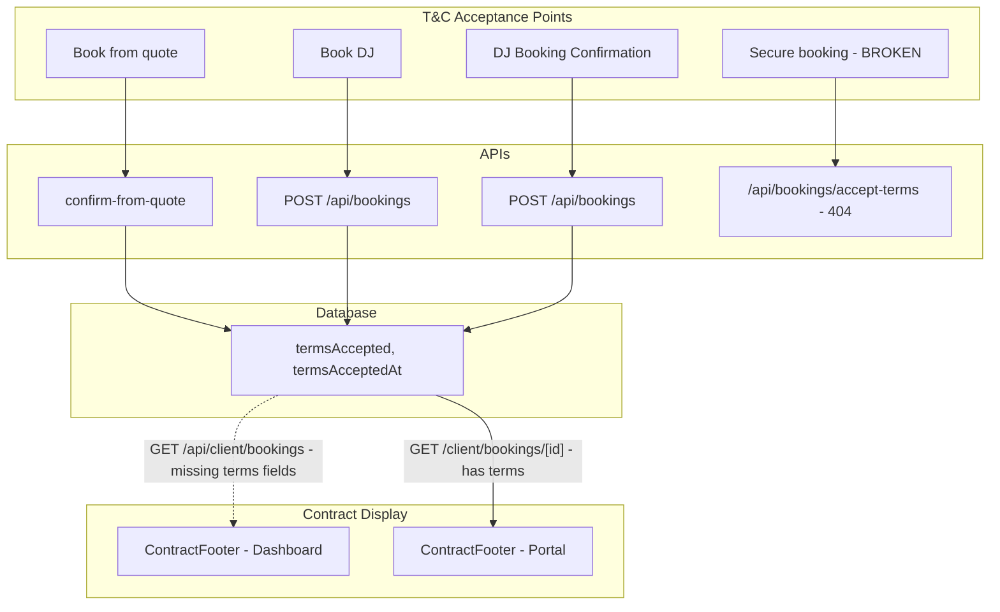

# Terms & Conditions Acceptance → Contract Audit

**Date:** January 2025  
**Scope:** Flow and UX of T&C acceptance across booking paths, and how it populates into the contract view.

---

## Executive Summary

T&C acceptance is implemented in some booking flows but not others. The **contract** (ContractFooter) displays acceptance status and allows PDF download, but clients cannot accept terms from within the portal. The secure-booking flow calls a non-existent API. The dashboard bookings list does not fetch terms data, so ContractFooter may show incorrect status.

---

## 1. Entry Points & Acceptance Flow

| Flow | Route | T&C Component | API | Stores |
|------|-------|---------------|-----|--------|
| **Book from quote** | `/book-from-quote` | AcceptTermsModule (checkbox + dialog) | `POST /api/bookings/confirm-from-quote` | termsAccepted, termsAcceptedAt |
| **Book DJ** | `/book-dj` | AcceptTermsModule | `POST /api/bookings` | termsAccepted, termsAcceptedAt |
| **DJ booking confirmation** | `/dj-booking-confirmation` | Inline checkbox + link | `POST /api/bookings` | termsAccepted, termsAcceptedAt |
| **Secure booking** | `/dashboard/secure-booking` | Inline checkbox + dialog | `POST /api/bookings/accept-terms` | **API does not exist** – broken |
| **Client portal new booking** | `/client/bookings/new` | None | `POST /api/client/bookings` | Does not store terms |
| **Client portal (per booking)** | `/client/bookings/[id]` | ContractFooter (view only) | N/A | No acceptance in portal |

---

## 2. AcceptTermsModule UX

**Location:** `components/AcceptTermsModule.tsx`

**Behaviour:**
- Checkbox: "I accept the Terms & Conditions."
- "Terms & Conditions" opens a **dialog** with full T&C from `lib/terms-content.ts`
- Optional "Download quote summary (PDF)" – date, venue, artist, fee (not the contract)
- Submit disabled until checkbox checked

**Used by:** Book DJ, Book from quote

**Gaps:**
- DJ booking confirmation uses its own inline checkbox + link to `/terms-and-conditions` instead of the module – inconsistent UX
- No IP capture for digital signature proof (schema has no `termsAcceptedIp`)

---

## 3. Contract Display (ContractFooter)

**Locations:**
- Dashboard: `app/client/dashboard/SingleEventHero.tsx` (single booking view)
- Portal: `components/client/PortalView.tsx` (booking detail page)

**Behaviour:**
- Title: "Contract & agreement"
- If `termsAccepted && termsAcceptedAt`: "Confirmed" badge + "Download PDF" button
- If not: "Terms acceptance pending" + "View Terms & Conditions" link
- PDF: "Booking Agreement" with event details, client name, venue, date, and (when available) acceptance timestamp and IP

**Data expected:**
- `termsAccepted` or `terms_accepted`
- `termsAcceptedAt` or `acceptance_timestamp`
- `termsAcceptedIp` or `acceptance_ip` (optional – schema has no field for it)

**Schema:** `Booking.termsAccepted` (Boolean), `Booking.termsAcceptedAt` (DateTime?). No `termsAcceptedIp` in Prisma.

---

## 4. Data Flow Gaps

### 4.1 Dashboard bookings list

`GET /api/client/bookings` does **not** include `termsAccepted` or `termsAcceptedAt` in the `select`:

```ts
select: {
  id: true,
  name: true,
  venueName: true,
  eventDate: true,
  // ... no termsAccepted, termsAcceptedAt
}
```

**Impact:** SingleEventHero receives bookings without contract data. ContractFooter will treat them as "Terms acceptance pending" even when terms were accepted via book-from-quote or book-dj.

### 4.2 Secure booking – broken

`/dashboard/secure-booking` calls:

```ts
fetch("/api/bookings/accept-terms", {
  body: JSON.stringify({
    terms_accepted: true,
    acceptance_timestamp: new Date().toISOString(),
    acceptance_ip: userIpAddress,
    booking_id: "placeholder",  // hardcoded placeholder
  }),
});
```

- **`/api/bookings/accept-terms` does not exist** – 404
- Uses `booking_id: "placeholder"` – not wired to a real booking
- Sends `acceptance_ip` but schema has no field to store it

### 4.3 Client portal – no acceptance

Clients viewing their booking in the portal can:
- See contract status (Confirmed or Pending)
- View Terms & Conditions link
- Download PDF when confirmed

They **cannot** accept terms from the portal. Acceptance only happens at:
- Book from quote
- Book DJ
- DJ booking confirmation

If a booking was created via contact form or client portal new booking (no T&C step), the client has no in-portal way to accept.

---

## 5. Quote Summary vs Contract PDF

| Document | Source | When | Purpose |
|----------|--------|------|---------|
| **Quote Summary PDF** | `lib/quote-summary-pdf.ts` | Before/at acceptance (AcceptTermsModule) | Optional pre-acceptance reference – date, venue, artist, fee |
| **Booking Agreement PDF** | ContractFooter (client-side jsPDF) | After viewing in dashboard/portal | Contract proof – event details + acceptance timestamp (+ IP if available) |

The "quote summary" is not the contract. The contract is the "Booking Agreement" generated in ContractFooter.

---

## 6. Email Templates & Contract Data

`lib/email-template-utils.ts`:
- `getTCLink(termsAccepted, termsAcceptedAt)` – returns T&C URL only if both are set
- `populateEmailTemplate` – uses `contractData` (date, venue, fee, talent) and `booking.termsAccepted` / `termsAcceptedAt`
- `{{tc_link}}` token in emails – only populated when terms are accepted

Admin email templates can reference contract data and `{{tc_link}}` for locked-in booking details.

---

## 7. UX Recommendations

1. **Fix secure booking:** Create `POST /api/bookings/accept-terms` (or similar) that updates a real booking by ID, or retire secure-booking if it is deprecated.
2. **Dashboard API:** Add `termsAccepted` and `termsAcceptedAt` to `GET /api/client/bookings` select so ContractFooter shows correct status.
3. **Consistent T&C component:** Use AcceptTermsModule on DJ booking confirmation page for consistency with Book DJ and Book from quote.
4. **Client portal acceptance (optional):** If clients should accept terms post-booking (e.g. created via contact form), add an acceptance flow in the portal – e.g. inline form or link to a dedicated accept-terms page with token.
5. **IP for contract proof (optional):** Add `termsAcceptedIp` to Prisma schema if digital signature evidence is required; wire secure-booking and any future accept-terms flow to store it.

---

## 8. Flow Diagram



---

## 9. File Reference

| File | Role |
|------|------|
| `components/AcceptTermsModule.tsx` | Reusable T&C checkbox + dialog |
| `lib/terms-content.ts` | T&C sections (single source) |
| `app/client/dashboard/SingleEventHero.tsx` | ContractFooter component |
| `app/api/bookings/confirm-from-quote/route.ts` | Stores terms on quote confirm |
| `app/api/bookings/route.ts` | POST bookings with terms |
| `app/api/client/bookings/route.ts` | Client bookings – no terms in create or list |
| `app/dashboard/secure-booking/page.tsx` | Calls non-existent accept-terms API |
